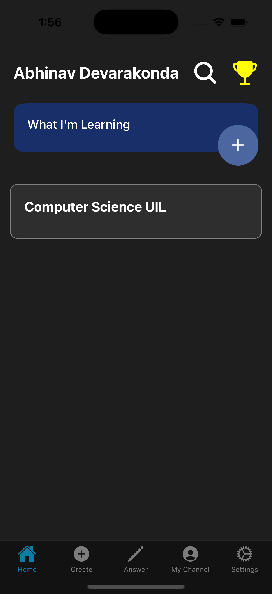
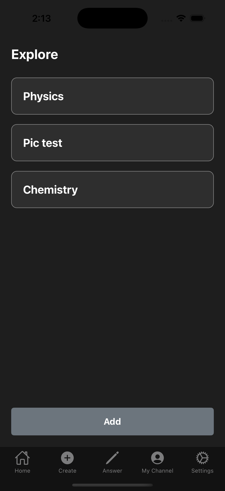
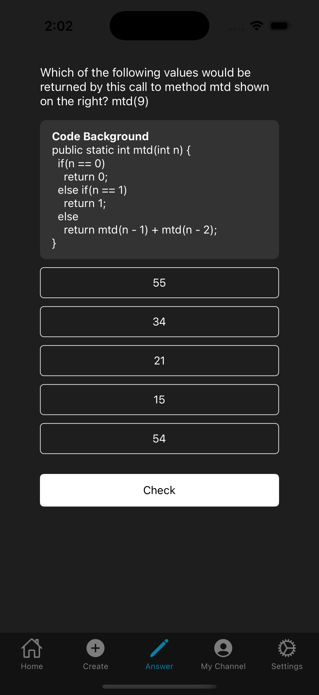
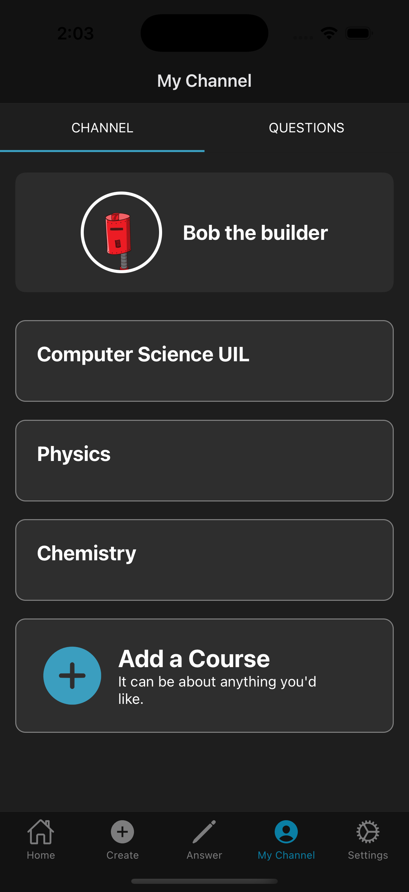
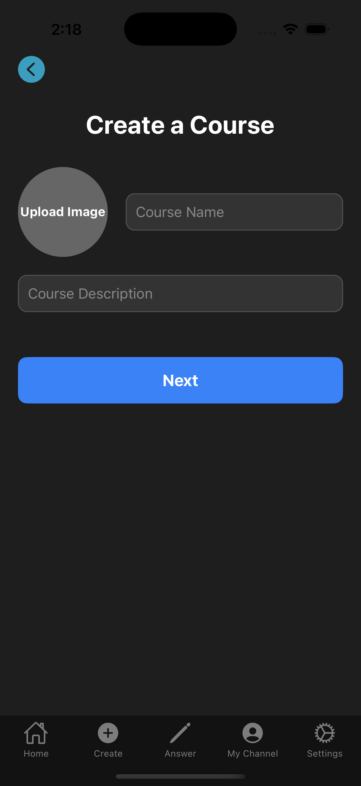
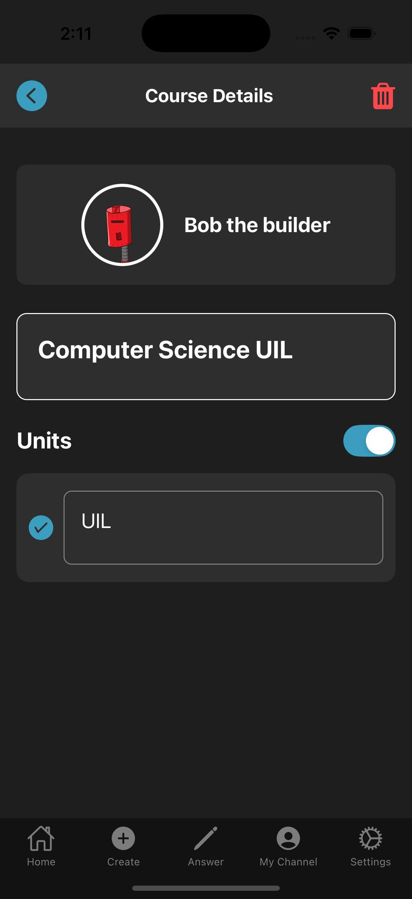
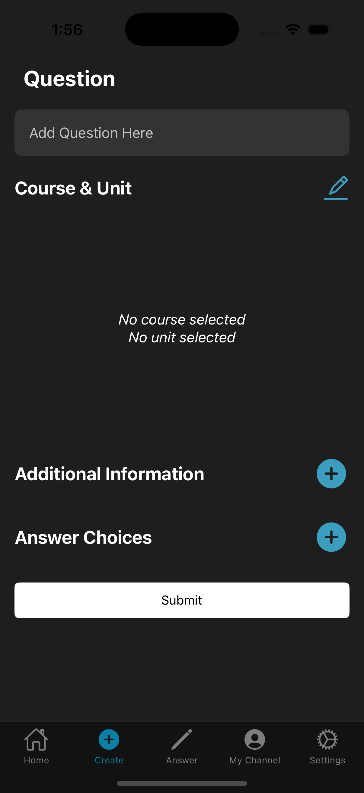

# Welcome to StudyBits

An open source framework for a study app

## View features

### Manage the courses you are learning

### Explore and add courses to the list of courses you are learning

### Answer questions about courses you are learning

### Manage  the courses you are creating questions for

### Create a course to create questions for

### Manage the units you want questions about

### Manage the units of your courses

### Create questions for your courses

